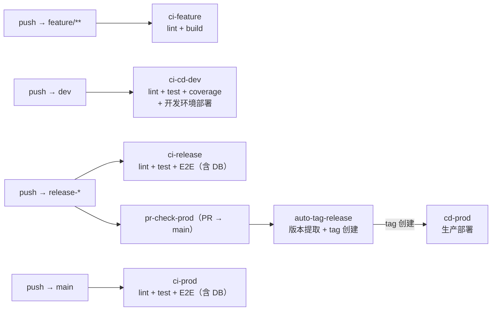

> [!Warning]
> 此仓库目前处于快速迭代期，README 文档可能与实际代码存在不一致。一切内容以具体实现为准，相关文档会在后续版本中逐步完善。

<div align="center">

<h1>NestJS Demo Basic</h1>

<p align="center">
  NestJS 生产级后端基线模板——认证系统、分层架构、CI 流水线、容器化部署、结构化日志、开箱即用
</p>

<p align="center">
  
  
  
  
  
</p>

</div>

---

## 前提条件

| 依赖 | 版本要求 | 说明 |
| ---- | -------- | ---- |
| Node.js | ≥ 20.0.0 | 运行时 |
| pnpm | ≥ 8.0.0 | 包管理器 |
| PostgreSQL | ≥ 15 | 主数据库（可选，仅使用数据库功能时必须） |
| Docker | — | 容器化部署（可选） |

---

## 快速开始

**1. 克隆项目**

```bash
git clone https://github.com/your-username/nestjs-demo-basic.git my-project
cd my-project
```

**2. 安装依赖**

```bash
pnpm install
```

**3. 配置环境变量**

本项目使用 [dotenvx](https://dotenvx.com/encryption) 对环境变量文件进行加密。仓库中已包含加密后的 `.env.development` / `.env.production` / `.env.test`，对应的解密私钥存储在 `.env.keys`（**不提交到版本控制**）。

如需自行初始化：

```bash
# 初始化一套新的密钥对并生成加密后的 .env.development
npx @dotenvx/dotenvx set PORT 3000 --env-file .env.development
```

或直接在 `.env.keys` 中填入已有私钥，dotenvx 会在应用启动时自动解密对应的 `.env.<NODE_ENV>` 文件。

**4. 初始化ORM**

```bash
pnpm db:gen-client   # 生成 Prisma Client
```

**5. 启动开发服务器**

```bash
pnpm start:dev
```

---

## 核心特性

### 认证与安全

- **JWT RS256 双令牌**：Access Token（短期）+ Refresh Token（Cookie），支持令牌轮换
- **Zod 校验**：所有请求入口通过 Zod schema 强校验，拒绝非法输入
- **三级限流**：`@nestjs/throttler` 在全局守卫层拦截异常请求
- **Helmet + CORS 白名单**：开箱即用的安全响应头与跨域控制

### AOP 切面机制

请求链路中的横切关注点全部通过 NestJS 装饰器机制实现，不侵入业务逻辑：

| 切面 | 实现 | 职责 |
| ---- | ---- | ---- |
| 认证 | `AuthGuard` | JWT 验签，挂载 `jwtClaim` |
| 响应格式化 | `ResponseFormatInterceptor` | 统一 `{ success, data, ... }` 结构 |
| 性能监控 | `PerformanceInterceptor` | 慢请求告警（≥1000ms warn / ≥3000ms error） |
| 超时保护 | `TimeoutInterceptor` | 30s 硬超时 |
| 异常兜底 | `AllExceptionsFilter` | 统一错误响应，映射 `BusinessException` 错误码 |
| 请求日志 | `AppMiddleware` | Pino 结构化 JSON 日志，携带 ULID 请求 ID |

### 可观测性

- **Pino 结构化日志**：JSON 格式，每条日志携带 `req.id`（ULID）、`responseTime`、`context`
- **AsyncLocalStorage 链路追踪**：请求 ID 自动跟随整条调用链，无需手动传参
- **慢查询监控**：数据库查询 ≥100ms warn / ≥500ms error，自动脱敏参数

### 分层架构

```
Controller → Service → Repository (Prisma)
```

所有模块遵循单向依赖：`infra/` 不引用 `modules/`；不同业务模块之间不直接互相引用，共享逻辑（工具函数、装饰器、异常等）统一放在 `common/` 中按需导入。

---

## 目录结构

```
nestjs-demo-basic/
├── .github/
│   └── workflows/              # 10 个 GitHub Actions 工作流
├── config/                     # 静态配置文件
├── docs/                       # 项目文档（架构、规范、规划）
├── prisma/
│   ├── schema.prisma           # 数据库模型定义
│   ├── migrations/             # 数据库迁移文件
│   └── generated/              # Prisma Client 生成产物
├── scripts/                    # 版本管理与发布脚本
├── src/
│   ├── common/
│   │   ├── decorators/         # 自定义装饰器
│   │   ├── exceptions/         # BusinessException
│   │   ├── services/           # RequestContextService、LoggerService
│   │   └── utils/              # 工具函数（helpers / formatters / validators / errors）
│   ├── constants/              # 全局常量（含错误码目录）
│   ├── infra/
│   │   └── database/           # DatabaseService（Prisma + PG Adapter）
│   ├── modules/
│   │   ├── auth/               # 注册、登录、令牌刷新
│   │   └── error-catalog/      # GET /errors 错误码自文档化
│   ├── types/                  # Express Request 类型扩展
│   ├── app.module.ts           # 根模块
│   └── main.ts                 # 应用入口
└── test/
    ├── unit/                   # 单元测试
    └── e2e/                    # E2E 测试（需要数据库连接）
```

---

## 可用命令

```bash
# 开发
pnpm start:dev          # 热重载开发服务器
pnpm start:prod         # 生产模式启动
pnpm build              # 编译 + 路径别名替换（tsc + tsc-alias）

# 代码质量
pnpm lint               # ESLint 检查
pnpm lint:fix           # ESLint 自动修复
pnpm format             # Prettier 格式化

# 测试
pnpm test               # 单元测试 + E2E 测试
pnpm test:watch         # 监听模式
pnpm test:cov           # 覆盖率报告

# 数据库
pnpm db:migrate         # 数据库迁移（prisma migrate dev）
pnpm db:gen-client      # 重新生成 Prisma Client
pnpm db:studio          # 数据库可视化界面
pnpm db:seed            # 数据库种子数据
```

---

## 技术栈

| 层级 | 技术 | 版本 |
| ---- | ---- | ---- |
| 运行时 | Node.js | ≥ 20.0.0 |
| 语言 | TypeScript（strict, ESM, nodenext） | 5.x |
| 框架 | NestJS | 11.x |
| ORM | Prisma + `@prisma/adapter-pg` | 7.x |
| 数据库 | PostgreSQL | ≥ 15 |
| 认证 | JWT RS256 + bcryptjs | — |
| 校验 | Zod 4 + nestjs-zod | — |
| 日志 | Pino + nestjs-pino | — |
| 安全 | Helmet + @nestjs/throttler + CORS | — |
| 测试 | Jest 30 + Supertest | — |
| 容器 | Docker 多阶段（node:22-slim） | — |
| 包管理 | pnpm | ≥ 8.0.0 |

---

## CI/CD 工作流


```mermaid
flowchart LR
    FT["push → feature/**"] --> CF["ci-feature\nlint + build"]
    DV["push → dev"] --> CICDD["ci-cd-dev\nlint + test + coverage\n+ 开发环境部署"]
    RL["push → release-*"] --> CR["ci-release\nlint + test + E2E（含 DB）"]
    RL --> PRD["pr-check-prod（PR → main）"]
    PRD --> AT["auto-tag-release\n版本提取 + tag 创建"]
    AT -- "tag 创建" --> CDP["cd-prod\n生产部署"]
    MN["push → main"] --> CP["ci-prod\nlint + test + E2E（含 DB）"]
```

完整 Workflow 清单见 [docs/02-architecture/cicd-deployment.md](docs/02-architecture/cicd-deployment.md)。

### 配置 Personal Access Token

`auto-tag-release.yaml` 需要推送 tag 来触发 `cd-prod.yaml`，而 GitHub Actions 默认 `GITHUB_TOKEN` 推送的 tag 不会触发其他工作流。需在仓库 Secrets 中配置名为 `PAT` 的 Fine-grained Token（`Contents: Read and write`）。

未配置时：tag 仍会创建，但生产部署工作流不会自动触发。

---

## Docker 部署

### 构建镜像

```bash
docker build -t nestjs-demo-basic .
```

### 运行容器

应用在启动时通过 dotenvx 解密 `.env.<NODE_ENV>` 文件，因此容器需要能获取到对应的**解密私钥**。有两种方式：

**方式一：挂载 `.env.keys` 文件（推荐本地开发）**

```bash
docker run \
  --mount type=bind,source=/path/to/.env.keys,target=/app/.env.keys,readonly \
  -e NODE_ENV=development \
  -p 3000:3000 \
  --name nestjs-demo-basic \
  nestjs-demo-basic
```

**方式二：通过环境变量注入私钥（推荐 CI/CD 和生产环境）**

```bash
docker run \
  -e DOTENV_PRIVATE_KEY_PRODUCTION="<your-private-key>" \
  -e NODE_ENV=production \
  -p 3000:3000 \
  nestjs-demo-basic
```

`DOTENV_PRIVATE_KEY_<ENV>` 变量名中的后缀需与 `NODE_ENV` 对应（如 `DEVELOPMENT` / `PRODUCTION` / `TEST`）。

> `.env.keys` 包含所有环境的私钥，**绝不能提交到版本控制或打入镜像**。

---

## 贡献指南

分支策略、提交规范（Conventional Commits）与发布流程详见 [docs/01-guides/contributing.md](docs/01-guides/contributing.md)。

提交 PR 前确认：

- [ ] `pnpm lint` 零报错
- [ ] `pnpm build` 编译通过
- [ ] `pnpm test` 测试通过
- [ ] 提交信息符合 Conventional Commits 规范

---

## 文档

完整文档见 [docs/](docs/)，索引入口：[docs/README.md](docs/README.md)。

| 文档 | 说明 |
| ---- | ---- |
| [docs/01-guides/contributing.md](docs/01-guides/contributing.md) | 分支策略、提交规范、发布流程 |
| [docs/02-architecture/project-architecture-overview.md](docs/02-architecture/project-architecture-overview.md) | 技术栈、分层图、模块职责 |
| [docs/02-architecture/request-pipeline.md](docs/02-architecture/request-pipeline.md) | 请求生命周期全链路 |
| [docs/02-architecture/auth-module.md](docs/02-architecture/auth-module.md) | JWT RS256 双令牌、Cookie、令牌轮换 |
| [docs/02-architecture/database.md](docs/02-architecture/database.md) | 连接池、慢查询监控、参数脱敏 |
| [docs/02-architecture/observability.md](docs/02-architecture/observability.md) | Pino 日志、链路追踪、告警阈值 |
| [docs/02-architecture/cicd-deployment.md](docs/02-architecture/cicd-deployment.md) | CI/CD Workflow 矩阵、自动打标、Docker 构建 |
| [docs/03-reference/api-reference.md](docs/03-reference/api-reference.md) | API 接口参考 |
| [docs/04-planning/roadmap.md](docs/04-planning/roadmap.md) | 版本路线图 |

---

## 更新日志

见 [CHANGELOG.md](CHANGELOG.md)。

---

## 许可证

[MIT](LICENSE) © FOV-RGT
