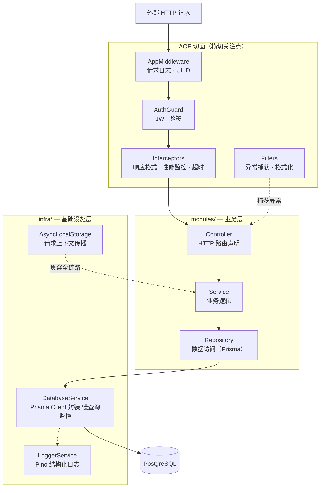

---
title: 项目简介
status: active
version: "0.7.4"
last-updated: 2026-04-09
category: guide
---

# 项目简介

**NestJS Scaffold** 是一个 NestJS 后端开发基线模板，也是一个学习项目。它起步于我学习 NestJS、后端工程实践、面向切面编程、CI/CD 工作流编排与 Harness Engineering 的过程中——在不断踩坑、整理、重构的过程里，逐渐沉淀成了现在的样子。

它同时有两个目的：一是把这段学习过程中形成的工程实践固化下来，成为日后开发新项目的可复用起点；二是把 Harness Engineering 的理念落地——让 AI 在这个代码库里能够可靠地协作，而不是乱改一通。

如果你也在学习 NestJS 或探索类似的工程体系，这个项目可能对你有参考价值。

## 它为你解决什么问题

每次启动一个新的 NestJS 项目，你大概都要重新搞定这些事：

| 头疼的地方 | 模板帮你搞定的方式 |
|-----------|----------------|
| 认证体系重复实现 | JWT ES256 双令牌（Access + Refresh），含令牌静默轮换 |
| 日志和链路追踪难串联 | Pino JSON 日志 + AsyncLocalStorage，请求 ID 自动贯穿全链路 |
| 请求校验分散在各处 | Zod Schema 统一校验，编译期类型安全 |
| 错误格式五花八门 | `AppException` 分层继承体系 + `@RegisterException` 按域注册，统一结构化错误响应 |
| CI/CD 每次从头配 | 10 个开箱即用的 GitHub Actions 工作流 |
| 文档和代码越来越脱节 | `@ApiRoute` 装饰器驱动 OpenAPI 自动生成，Scalar 内嵌文档站 |
| AI 助手乱改代码 | AGENTS.md + 完善的文档 + 自动化质量门控，构成 Harness Engineering 闭环 |

## 核心理念

这个模板的所有设计选择，都源自三个核心理念：

**[Harness Engineering](../02-harness/overview)**：让 AI 能可靠地协作。通过精心设计的引导层（AGENTS.md、架构文档）和感知层（测试、lint、CI），形成一个让 AI“不容易犯错”的开发环境。

**文档即代码**：文档和代码在同一仓库、同一 PR 里一起提交演进。文档有质量标准、有版本号、有漂移检测。

**测试驱动开发**：`pnpm test` 通过是任务完成的硬门槛。Service 层必须有单元测试，API 端点必须有 E2E 测试。

> 想深入理解？[核心理念 →](./philosophy) 有更完整的解释。

## 主要特性

### 认证与安全

- **JWT ES256 双令牌**：Access Token（短期，Bearer Header）+ Refresh Token（HttpOnly Cookie），支持静默轮换
- **限流保护**：`@nestjs/throttler` 全局通用限流，可通过 `THROTTLE_TTL_MS` / `THROTTLE_LIMIT` 环境变量调整
- **Helmet**：开箱即用的安全 HTTP 响应头（CSP、HSTS、X-Frame-Options 等）
- **CORS 白名单**：基于环境变量的跨域来源控制

### AOP 切面机制

横切关注点全部通过 NestJS 装饰器机制实现，业务 Service 代码里找不到一行日志或认证代码：

| 切面 | 实现类 | 职责 |
|------|--------|------|
| 认证 | `AuthGuard` | JWT 验签，三策略路由声明 |
| 响应格式化 | `ResponseFormatInterceptor` | 统一 `{ success, data, timestamp, context }` |
| 性能监控 | `PerformanceInterceptor` | 慢请求分级告警 |
| 超时保护 | `TimeoutInterceptor` | 30s 硬超时 |
| 异常兜底 | `AllExceptionFilter` + 专用 Filter | 统一错误响应 |
| 请求日志 | `AppMiddleware` | Pino JSON 日志，携带 ULID 请求 ID |

### 可观测性

- **Pino 结构化日志**：JSON 格式，每条日志携带 `req.id`（ULID）、`responseTime`、`context`
- **AsyncLocalStorage 链路追踪**：请求 ID 自动随调用链传递，无需手动传参
- **慢查询/慢请求监控**：分级阈值自动告警，参数自动脱敏

### 分层架构



`infra/` 单向依赖 `modules/`，模块间不直接互引用，公共逻辑统一放 `common/`。

## 技术栈

| 层级 | 技术 | 版本 |
|------|------|------|
| 运行时 | Node.js | ≥ 22.0.0 |
| 语言 | TypeScript（strict, ESM, nodenext）| 5.x |
| 框架 | NestJS | 11.x |
| ORM | Prisma + `@prisma/adapter-pg` | 7.x |
| 数据库 | PostgreSQL | ≥ 18 |
| 认证 | JWT ES256 + bcryptjs | — |
| 校验 | Zod 4 + nestjs-zod | — |
| 日志 | Pino + nestjs-pino | — |
| 安全 | Helmet + @nestjs/throttler | — |
| 测试 | Jest 30 + Supertest | — |
| 容器 | Docker 多阶段（node:22-slim）| — |
| 包管理 | pnpm | ≥ 8.0.0 |

## 目录结构一览

```
nestjs-scaffold/
├── .github/workflows/      # 10 个 GitHub Actions 工作流
├── .agents/skills/         # AI 助手技能文档
├── config/                 # 静态配置（JWT 密钥等）
├── docs/                   # 项目文档（文档即代码）
├── prisma/
│   ├── schema.prisma       # 数据库模型
│   ├── migrations/         # 迁移文件
│   └── generated/          # Prisma Client 生成产物
├── scripts/                # 版本管理与发布脚本
├── src/
│   ├── common/             # 装饰器、异常、工具函数
│   ├── constants/          # 全局常量与错误码目录
│   ├── infra/              # 数据库、日志等基础设施
│   ├── modules/            # 业务模块（auth、exception-catalog）
│   ├── types/              # Express Request 类型扩展
│   └── main.ts             # 应用入口
├── test/
│   ├── unit/               # 单元测试
│   └── e2e/                # E2E 测试（需数据库连接）
└── website/                # VitePress 文档站
```

## 接下来做什么？

- **新来的？** → [快速上手](./quick-start)，5 分钟把项目跑起来
- **想用好这个模板？** → [核心理念](./philosophy)，理解设计背后的思考
- **要搭建开发环境？** → [环境搭建](../01-guides/environment-setup)，详细步骤
- **对架构感兴趣？** → [项目架构全览](../03-architecture/project-architecture-overview)
