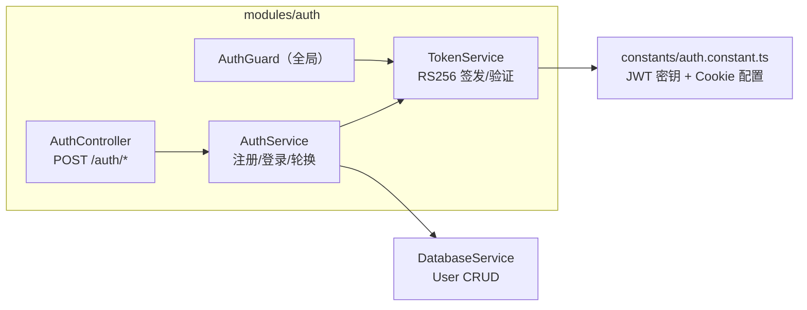
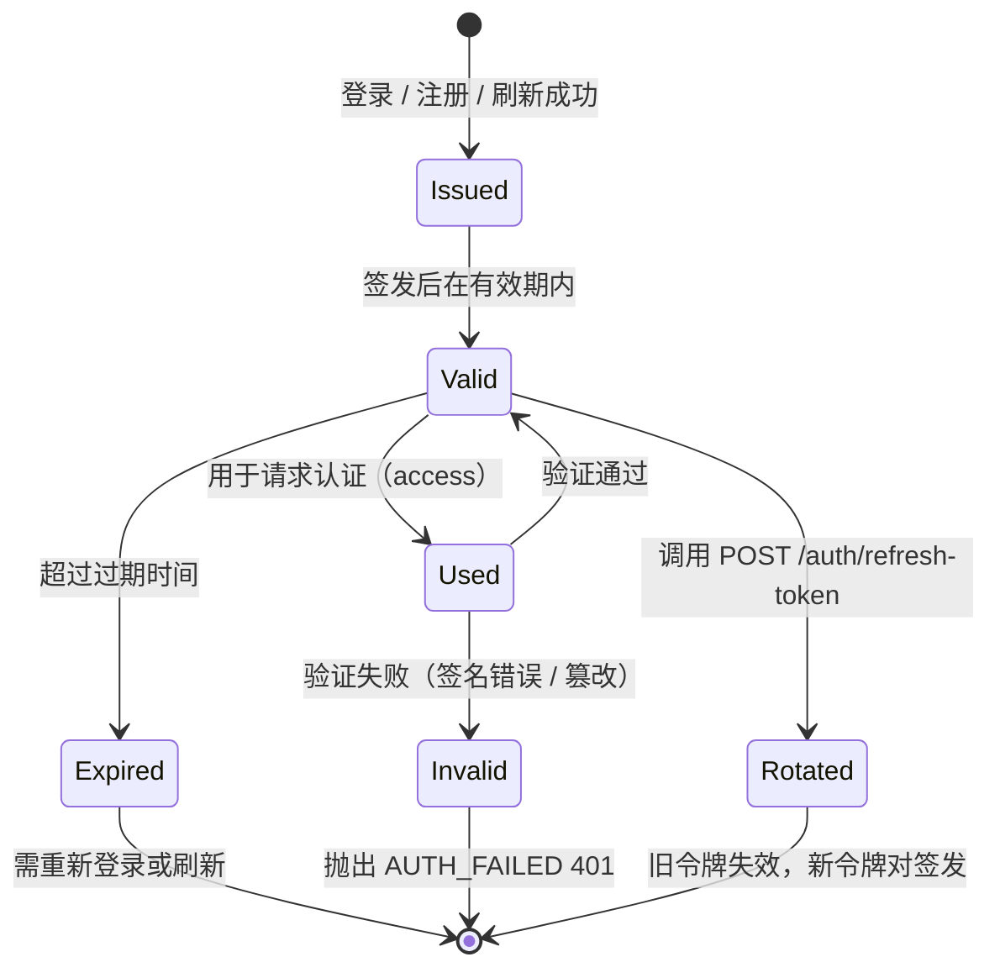
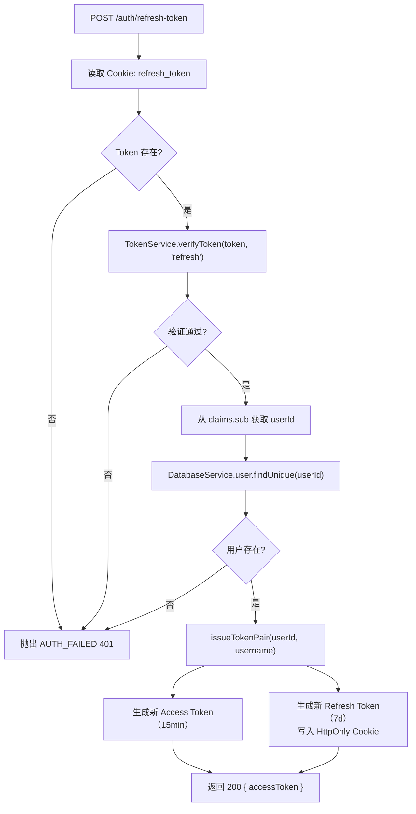

# 认证模块

`src/modules/auth/` 实现双令牌 JWT 认证，提供注册、登录、令牌刷新功能。

---

## 1. 模块结构



---

## 2. 双令牌策略

| 属性 | Access Token | Refresh Token |
|------|-------------|---------------|
| 过期 | 15 分钟（`JWT_ACCESS_EXPIRES_IN`）| 7 天（`JWT_REFRESH_EXPIRES_IN`）|
| 算法 | RS256（RSA 非对称）| RS256（RSA 非对称）|
| 传输 | `Authorization: Bearer <token>` 请求头 | HttpOnly Cookie（名称：`refresh_token`）|
| Claims | `sub, jti(ULID), tokenType:'access', user{...}` | `sub, jti(ULID), tokenType:'refresh'` |

**选择 RS256 的理由**：公钥可安全分发给第三方服务进行本地验证，无需共享签名密钥，支持密钥分离架构。HS256 共享密钥无法安全分发。

---

## 3. JWT Claims 结构

**Access Token** payload：

```typescript
{
  sub: string,            // 用户 ID（ULID）
  iat: number,            // 签发时间戳
  exp: number,            // 过期时间戳
  jti: string,            // 令牌唯一 ID（ULID，防重放）
  tokenType: 'access',
  user: {
    id: string,
    username: string,
    email: string,
    createdAt: string,
    updatedAt: string
    // 不包含 passwordHash
  }
}
```

**Refresh Token** payload（轻量，不含用户详情）：

```typescript
{
  sub: string,
  iat: number,
  exp: number,
  jti: string,
  tokenType: 'refresh'
}
```

---

## 4. Refresh Token Cookie 配置

Refresh Token 通过 HttpOnly Cookie 传输，防止 XSS 窃取。

| 属性 | 默认值 | 环境变量 |
|------|--------|---------|
| Cookie 名 | `refresh_token` | — |
| HttpOnly | `true` | — |
| Path | `/auth` | `JWT_REFRESH_COOKIE_PATH` |
| SameSite | `lax` | `JWT_REFRESH_COOKIE_SAME_SITE` |
| Secure | `false`（开发）| `JWT_REFRESH_COOKIE_SECURE` |
| 最大寿命 | 604800000ms（7 天）| `JWT_REFRESH_COOKIE_MAX_AGE_MS` |

> 生产环境必须设置 `JWT_REFRESH_COOKIE_SECURE=true`。

---

## 5. 令牌生命周期



---

## 6. API 端点

| 方法 | 路径 | 权限 | 请求体 | 响应 |
|------|------|------|--------|------|
| `POST` | `/auth/register` | `@Public` | `{ username, email, password }` | `{ accessToken, user }` + 设置 Cookie |
| `POST` | `/auth/login` | `@Public` | `{ account, password }` | `{ accessToken, user }` + 设置 Cookie |
| `POST` | `/auth/refresh-token` | `@Public` | Cookie: `refresh_token` | `{ accessToken }` + 更新 Cookie |
| `GET` | `/auth/clear-cookie` | `@Public` | — | 清除 `refresh_token` Cookie |

`account` 字段同时接受 `username` 或 `email`，后端自动判断。

---

## 7. 令牌刷新流程



---

## 8. 密码处理

- 加密库：bcryptjs
- 加密成本：10 rounds（`bcrypt.hash(password, 10)`）
- 验证：`bcrypt.compare(inputPassword, storedPasswordHash)`
- 存储字段：`passwordHash`（不在任何响应体或 JWT Claims 中暴露）

---

## 9. 密钥配置

生产环境必须通过环境变量提供 RSA 密钥对（PEM 格式），禁止使用内置的 Dev 默认密钥：

| 环境变量 | 说明 |
|---------|------|
| `JWT_ACCESS_PRIVATE_KEY` | Access Token 签名私钥（RSA PEM）|
| `JWT_ACCESS_PUBLIC_KEY` | Access Token 验证公钥（RSA PEM）|
| `JWT_REFRESH_PRIVATE_KEY` | Refresh Token 签名私钥（RSA PEM）|
| `JWT_REFRESH_PUBLIC_KEY` | Refresh Token 验证公钥（RSA PEM）|
| `JWT_ACCESS_EXPIRES_IN` | Access Token 过期（默认 `'15m'`）|
| `JWT_REFRESH_EXPIRES_IN` | Refresh Token 过期（默认 `'7d'`）|

---

## 引用

- [架构设计规范](STANDARD.md)
- [项目架构全览](project-architecture-overview.md)
- [请求处理链路](request-pipeline.md)
