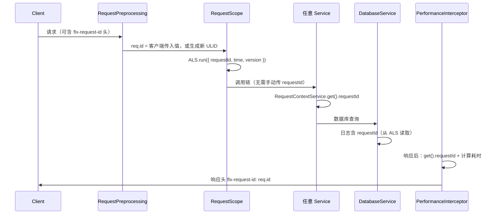

# 可观测性

日志、请求追踪与告警机制的协作方式。

---

## 1. 全链路概览

```
HTTP Request
  → RequestPreprocessingMiddleware  [分配 ULID req.id，注入 req.version]
  → RequestScopeMiddleware          [初始化 AsyncLocalStorage 上下文]
  → 业务链路（任意层可调用 RequestContextService.get()）
  → DatabaseService.$on('query')    [查询耗时 → 分级日志，含脱敏参数]
  → PerformanceInterceptor          [响应后计算总耗时 → 分级日志]
  → 响应头 flx-request-id: req.id   [透传给客户端，便于端侧关联]
```

---

## 2. 日志基础设施

| 组件 | 说明 |
|------|------|
| 核心库 | Pino 10（原生 JSON，多线程友好，高性能）|
| NestJS 集成 | nestjs-pino + pino-http |
| 开发环境 | pino-pretty（彩色格式化 console 输出）|
| 生产环境 | 写入 `logs/app.log`（JSON Lines 格式）|

---

## 3. 请求链路追踪

每个 HTTP 请求使用 ULID 作为追踪 ID，通过 `AsyncLocalStorage` 贯穿全链路，无需手动传参：



---

## 4. RequestContextService

`AsyncLocalStorage` 的类型化封装，提供请求级别的隔离上下文。

| 方法 | 说明 |
|------|------|
| `run(context, callback)` | 在指定上下文中执行回调（由 RequestScopeMiddleware 调用）|
| `get()` | 返回当前上下文的深拷贝（任意层均可调用）|

`RequestContext` 结构：

```typescript
{
  requestId: string;       // ULID，来自 req.id
  time: number;            // 请求开始时间戳（ms）
  version?: string;        // 应用版本（来自 req.version）
}
```

调用 `get()` 时若上下文不存在（非 HTTP 上下文，如定时任务），返回 `undefined`，调用方需自行处理。

---

## 5. 告警阈值

所有阈值在 `src/constants/observability.constant.ts` 中定义，可通过环境变量覆盖：

| 类型 | warn 阈值 | error 阈值 | 环境变量 |
|------|----------|-----------|---------|
| HTTP 请求耗时 | ≥ 1000ms | ≥ 3000ms | `SLOW_REQUEST_WARN_MS`, `SLOW_REQUEST_ERROR_MS` |
| 数据库查询耗时 | ≥ 100ms | ≥ 500ms | `SLOW_QUERY_WARN_MS`, `SLOW_QUERY_ERROR_MS` |

---

## 6. 日志分级规则

**PerformanceInterceptor**（HTTP 请求耗时）：

| 条件 | 日志级别 |
|------|---------|
| 耗时 ≥ `SLOW_REQUEST_ERROR_MS`（3000ms）| `error` |
| `SLOW_REQUEST_WARN_MS` ≤ 耗时 < `SLOW_REQUEST_ERROR_MS`（1000–3000ms）| `warn` |
| 耗时 < 1000ms 且 HTTP ≥ 400 | `info` |
| 耗时 < 1000ms 且 HTTP < 400 | `debug` |

**DatabaseService**（查询耗时，详见 [database.md](database.md#4-慢查询监控)）：

| 条件 | 日志级别 |
|------|---------|
| 耗时 ≥ `SLOW_QUERY_ERROR_MS`（500ms）| `error` |
| `SLOW_QUERY_WARN_MS` ≤ 耗时 < `SLOW_QUERY_ERROR_MS`（100–500ms）| `warn` |
| 耗时 < 100ms | `debug` |

---

## 7. 日志字段参考

pino-http 自动注入或手动记录时的通用字段：

| 字段 | 来源 | 说明 |
|------|------|------|
| `req.id` | pino-http | 请求 ID（ULID）|
| `responseTime` | pino-http | 请求总耗时（ms）|
| `level` | Pino | `trace` / `debug` / `info` / `warn` / `error` / `fatal` |
| `context` | NestJS logger | 日志来源模块名（如 `AuthService`）|
| `requestId` | RequestContext | 链路追踪 ID（同 `req.id`）|
| `version` | RequestContext | 应用版本号 |

---

## 引用

- [架构设计规范](STANDARD.md)
- [项目架构全览](project-architecture-overview.md)
- [数据库](database.md)
