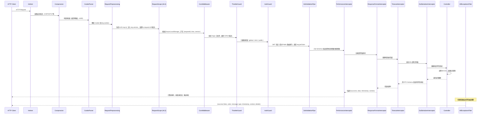
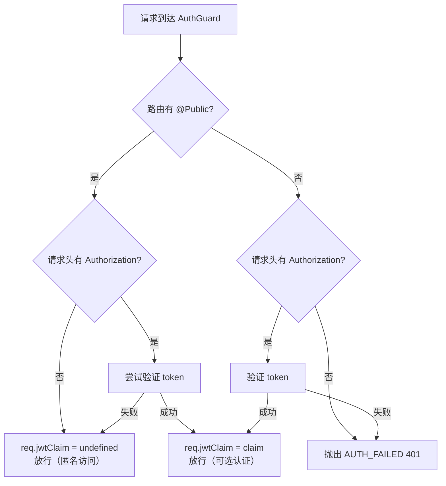

# 请求生命周期

一个 HTTP 请求从进入 NestJS 应用到返回响应所经历的完整处理链路。

---

## 1. 全链路序列图



---

## 2. Express 层（全局中间件）

在 `main.ts` 中通过 `app.use()` 按顺序挂载，所有请求均经过：

| 顺序 | 中间件 | 职责 | 触发条件 |
|------|--------|------|---------|
| 1 | `helmet()` | 设置安全 HTTP 响应头（CSP、HSTS、X-Frame-Options 等）| 所有请求 |
| 2 | `compression({ threshold: 1024 })` | 响应体 Gzip 压缩 | 响应体 ≥1024 字节 |
| 3 | `cookieParser()` | 解析 `Cookie` 请求头到 `req.cookies` | 所有请求 |

---

## 3. 自定义中间件

在 `app.module.ts` 的 `configure()` 中按顺序注册，顺序严格不可乱：

### 3.1 RequestPreprocessingMiddleware

**职责**：为每个请求分配唯一追踪 ID 并注入版本号。

| 操作 | 说明 |
|------|------|
| 读取 `flx-request-id` 请求头 | 若客户端已提供则复用，否则生成 ULID |
| 写入 `req.id` | 字符串类型，格式为 ULID（26 位字母数字）|
| 写入 `req.version` | 来自 `APP_VERSION` 常量 |
| 设置响应头 `flx-request-id` | 回传 ID 给客户端，便于链路关联 |

### 3.2 RequestScopeMiddleware

**职责**：在 AsyncLocalStorage 中建立请求级别的隔离上下文。

**依赖关系**：必须在 `RequestPreprocessingMiddleware` 之后执行（需要 `req.id`）。

初始化上下文结构：

```json
{
  "requestId": "01ARZ3NDEKTSV4RRFFQ69G5FAV",
  "time": 1737000000000,
  "version": "0.5.3"
}
```

效果：同一请求的异步调用链中任意位置（Service、DatabaseService 等）均可通过 `RequestContextService.get()` 访问 `requestId`，无需手动传参。

### 3.3 CorsMiddleware

**职责**：基于环境变量白名单的跨域请求控制。

| 请求类型 | 处理方式 |
|---------|---------|
| 无 `Origin` 头（移动端/CLI）| 直接放行 |
| `Origin` 在白名单内 | 设置 CORS 响应头，放行 |
| `Origin` 不在白名单 | 返回 403 |
| `OPTIONS` 预检请求 | 单独处理，返回 204 + 允许头 |

**白名单**：`ALLOWED_ORIGINS_DEV`（开发）/ `ALLOWED_ORIGINS_PROD`（生产），逗号分隔。

**CORS 响应头**：

```
Access-Control-Allow-Methods: GET, POST, PUT, DELETE, PATCH, OPTIONS
Access-Control-Allow-Headers: Content-Type, Authorization, flx-request-id
Access-Control-Allow-Credentials: true
Access-Control-Max-Age: 86400
```

---

## 4. 守卫层（全局，顺序固定）

### 4.1 ThrottlerGuard

三级限流，通过 `@Throttle({ [level]: {} })` 在路由或控制器上声明：

| 级别 | TTL | 生产上限 | 开发上限 | 适用场景 |
|------|-----|---------|---------|---------|
| `global` | 60s | 100 次 | 500 次 | 默认，全部路由 |
| `strict` | 60s | 20 次 | 100 次 | 登录、敏感操作 |
| `public` | 300s | 1000 次 | 无限制 | 公开 API |

超限时 `AllExceptionsFilter` 将 `ThrottlerException` 转换为 `429 RATE_LIMIT_EXCEEDED`。

### 4.2 AuthGuard

JWT RS256 守卫，通过 `@Public()` 装饰器声明免认证路由。



验证通过后 `req.jwtClaim` 结构：`{ sub, user: { id, username, email, ... }, tokenType: 'access', iat, exp, jti }`

---

## 5. 管道层

### ZodValidationPipe（全局）

对所有 `@Body()`、`@Query()`、`@Param()` 使用对应 DTO 的 Zod Schema 验证。

验证失败时抛出 `ZodValidationException`，`AllExceptionsFilter` 将其转换为：

```json
{
  "success": false,
  "code": "VALIDATION_FAILED",
  "details": [{ "field": "email", "message": "Invalid email", "code": "invalid_string" }]
}
```

---

## 6. 拦截器层（洋葱模型）

NestJS 全局拦截器以注册顺序形成嵌套包裹关系（先注册 = 最外层）：

```
请求方向：PI → RFI → TI → ZSI → Controller
响应方向：Controller → ZSI → TI → RFI → PI
```

| 拦截器 | 请求阶段 | 响应阶段 |
|--------|---------|---------|
| `PerformanceInterceptor` | 记录 `Date.now()` | 计算耗时，对照阈值分级日志 |
| `ResponseFormatInterceptor` | — | 包装为 `{ success: true, data, timestamp, context }` |
| `TimeoutInterceptor` | 启动 30s RxJS 超时（`REQUEST_TIMEOUT_MS` 可配置）| 取消计时 |
| `ZodSerializerInterceptor` | — | 用 DTO Schema 序列化验证响应体 |

**PerformanceInterceptor 日志分级**（阈值来自 `SLOW_REQUEST_THRESHOLDS`）：

| 条件 | 日志级别 |
|------|---------|
| 耗时 ≥ `error` 阈值（默认 3000ms）| `error` |
| `warn` 阈值 ≤ 耗时 < `error` 阈值（默认 1000-3000ms）| `warn` |
| 耗时 < `warn` 阈值 且 HTTP 状态 ≥ 400 | `info` |
| 耗时 < `warn` 阈值 且 HTTP 状态 < 400 | `debug` |

---

## 7. 全局异常过滤器（AllExceptionsFilter）

兜底捕获所有异常，转换为统一响应格式。

### 异常类型映射

| 异常类型 | Prisma 错误码 | HTTP 状态 | 错误码 | 日志级别 |
|---------|-------------|----------|--------|---------|
| `BusinessException` | — | 业务定义 | 业务定义 | `info` |
| `ZodValidationException` | — | 400 | `VALIDATION_FAILED` | `info` |
| `ThrottlerException` | — | 429 | `RATE_LIMIT_EXCEEDED` | `warn` |
| `RequestTimeoutException` | — | 408 | `REQUEST_TIMEOUT` | `warn` |
| `PrismaClientKnownRequestError` | P2002 | 409 | `UNIQUE_CONSTRAINT_VIOLATION` | `info` |
| `PrismaClientKnownRequestError` | P2003 | 400 | `FOREIGN_KEY_VIOLATION` | `info` |
| `PrismaClientKnownRequestError` | P2025 | 404 | `RECORD_NOT_FOUND` | `info` |
| `HttpException` | — | 原状态码 | `HTTP_EXCEPTION` | `info`/`error` |
| `ZodSerializationException` | — | 500 | `SERIALIZATION_ERROR` | `error` |
| 未知异常 | — | 500 | `UNEXPECTED_INTERNAL_SERVER_ERROR` | `fatal` |

### 错误响应格式

```json
{
  "success": false,
  "code": "ERROR_CODE",
  "message": "人类可读描述",
  "type": "https://api.example.com/errors/ERROR_CODE",
  "timestamp": "2026-03-26T12:00:00.000Z",
  "context": {
    "requestId": "01ARZ3NDEKTSV4RRFFQ69G5FAV",
    "version": "0.5.3",
    "user": { "id": "...", "username": "..." }
  },
  "details": null
}
```

`details` 仅在 `VALIDATION_FAILED` 时非空，格式为 `[{ field, message, code }]`。

`code` 字段全集见 `src/constants/error-catalog.constant.ts`，可通过 `GET /errors/:errorCode` 查看详情。

---

## 引用

- [架构设计规范](STANDARD.md)
- [项目架构全览](project-architecture-overview.md)
