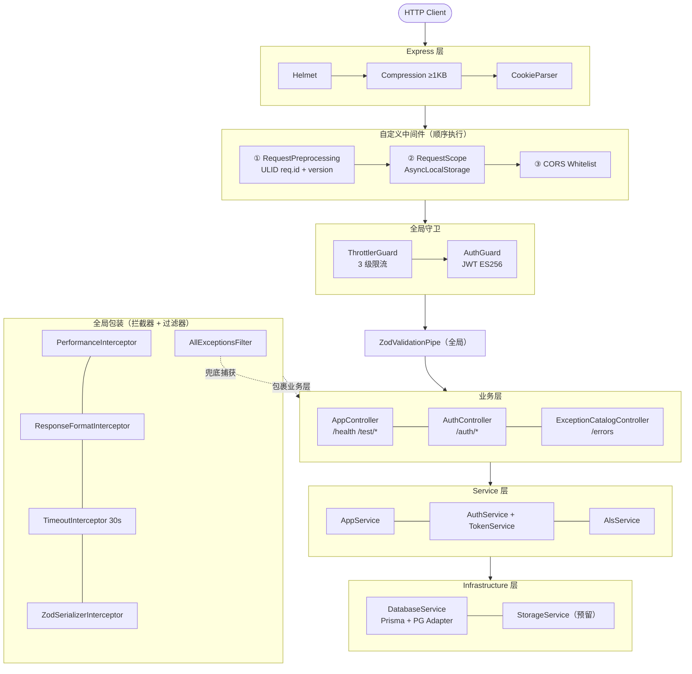

# 项目架构全览

> NestJS 生产级后端基线模板 v0.7.1。

## 1. 技术栈

| 层级 | 技术 | 版本 |
|------|------|------|
| 运行时 | Node.js | ≥22.0.0 |
| 语言 | TypeScript（strict, ESM, nodenext）| 5.9.3 |
| 框架 | NestJS | 11.1.17 |
| ORM | Prisma + `@prisma/adapter-pg` | 7.5.0 |
| 数据库 | PostgreSQL | ≥18 |
| 认证 | JWT ES256 + bcryptjs（10 rounds）| — |
| 验证 | Zod 4 + nestjs-zod | 4.3.6 |
| 日志 | Pino + nestjs-pino | 10.3.1 |
| 安全 | Helmet + @nestjs/throttler + CORS | — |
| 测试 | Jest 30 + Supertest | 30.3.0 |
| 容器 | Docker 多阶段（node:22-slim）| — |
| 包管理 | pnpm | ≥8.0.0 |

## 2. 系统分层结构

## 3. 模块职责

| 模块 | 路径 | 职责 |
|------|------|------|
| App | `src/app.*` | 全局中间件、拦截器、过滤器装配；健康检查 |
| Auth | `src/modules/auth/` | 注册/登录/刷新令牌；JWT 签发与验证 |
| ExceptionCatalog | `src/modules/exception-catalog/` | `GET /errors`：错误码自文档化 API |
| Common | `src/common/` | 工具函数库、装饰器、AppException / ClientException / SystemException 异常基类体系 |
| Constants | `src/constants/` | 所有常量的唯一定义来源 |
| Infra | `src/infra/` | `DatabaseService`（Prisma + PG）、存储抽象 |

## 4. 子文档导航

| 文档 | 核心问题 |
|------|---------|
| [request-pipeline.md](request-pipeline.md) | HTTP 请求经历哪些阶段？各阶段详细逻辑？ |
| [exception-system.md](exception-system.md) | 异常系统如何设计？|
| [auth-module.md](auth-module.md) | 双令牌策略如何工作？JWT 如何签发与验证？ |
| [database.md](database.md) | 连接池如何配置？查询如何监控与脱敏？ |
| [observability.md](observability.md) | 日志、追踪、告警如何串联？ |
| [cicd-deployment.md](cicd-deployment.md) | 代码如何从提交走到生产容器？ |

## 5. 关键设计决策摘要

下列决策对架构有全局影响：

| 决策 | 选择 | 核心理由 |
|------|------|---------|
| 认证算法 | JWT ES256（EC 非对称）| 公钥可分发，支持密钥分离；EC 密钥更短，性能优于 RSA；HS256 无法安全分发验证密钥 |
| 主键类型 | ULID | 时间有序（优于 UUID v4），适合数据库索引 |
| 日志库 | Pino | 性能最优，原生 JSON，nestjs-pino 官方集成 |
| 请求上下文 | AsyncLocalStorage | 无需手动传参，任意层级可访问请求 ID |
| 验证库 | Zod 4 | TypeScript-first，运行时验证与类型推断统一 |
